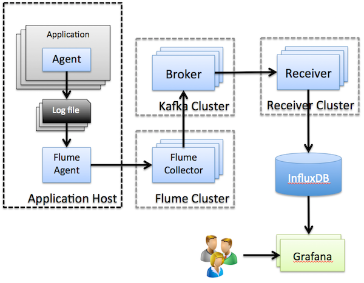

# infra-mgmt-monitor

## Introduction

This project is to investigate infrastructure management monitoring solution, the application
monitors a potentially large number of applications, which report metrics periodically and events
in real time. Both reports and events are in the same format. An application is typically a Java
process with a monitoring agent embedded; each agent may contain multiple modules, and module 
report its module separately. To make monitoring data manageable, a tree-like structure is used:

	domain/host/application/module*

Each agent has a main module already implemented, it serves as the "root" module. All submodules
defined by application are put under this module, and a module is allowed to contain other modules.

An architecture as follows are used

## Upstream reporting

In this project, the upstream reporting is done using log files. An application will include a 
monitoring agent, which writes to a pre-defined log file. Below steps describe how log files are
further collected

1. Application writes monitoring data (reports, events) to a predefined log file
2. A local Flume agent watches and sends content of this log file to a remote Flume collector
3. The remote Flume collector receives monitoring data from many Flume agents, and sends them 
to a Kafka topic "logs"
4. A set of Kafka consumers read monitoring data and save them in InfluxDB; In InfluxDB, one database
is used; each module is defined as a serie using its path described above. Note: each serie may
contain multiple metrics (columns)

## Upstream commands

The downstream command mechanism is done using JMX, which is straightforward. When there is
multiple applications running on the same host, it is necessary to know the port of the JMX
agent within each application. This is done by each monitoring agent reporting its JMX port.
Within an application, each module has a MBean that can take commands. Each MBean's namespace
must be defined according to the path above.    

## User interface

Grafana is used as the general purpose user interface.

## Discussions

Some important things to note

 - The overall architecture is horizontally scalable :)
 - The use of log files for reporting has very low overhead on applications. It is desirable 
   as long as an transportation infrastructure is available, which is the likely case for 
   may environments. 
 - The use of Flume as the first tier transport mechanism gives a lot of functionality such
   as serialization, compression, encryption, etc. for free. In most cases, no coding is
   required.
 - It is possible to feed monitoring data directly to the database, however the use of Kafka
   is a preparation for intermediate computation - many cases the reported raw data will go
   through some sort of stream processing facilities to have metrics calculated. In addition,
   Kafka also serves as a buffer for raw data.
 - InfluxDB itself claims to be a high performance and scalable time series database.
   It offers a SQL-like query interface and rich set of language bindings, which were simple
   enough to start with. In addition, it's been actively developed. But it is relatively 
   new (1 year old), which will have to be battle proofed. Not much investigation has 
   been done in terms of its query performance. It internally uses LevelDB, which is a key-value
   store: this is a bit doubtable! Alternatives could be OpenTSDB, if stream product such as 
   Spark is also used.
 - Grafana is a neat general purpose dashboard
 - RRDTool was also looked at, and deemed to be not suitable: it is generally a single-box
   solution. The Carbon layer Graphite added some tweaks to make the RRD-based Whisper
   database scalable, however the solution was cumbersome and complicated.     
 
## TODO

 - Try out OpenTSDB over HBase, Grafana supports it
 